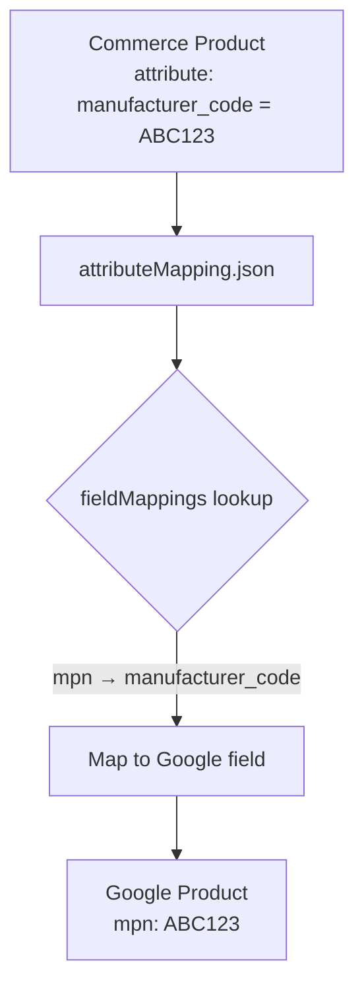
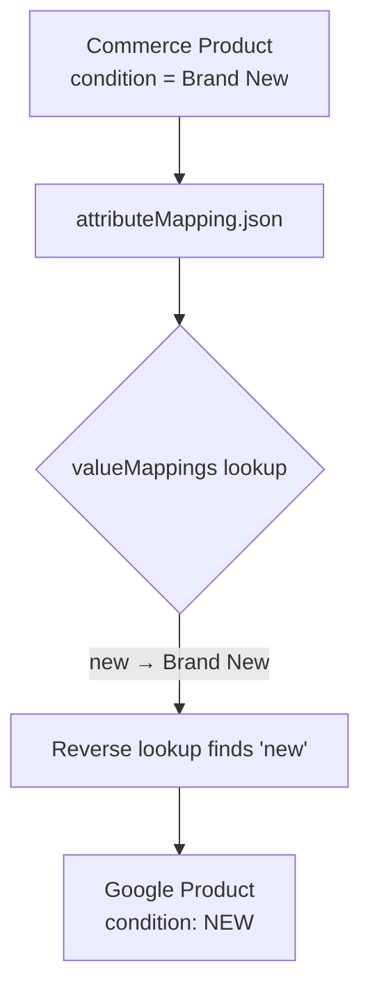

# Attribute Mapping Configuration

This configuration file defines how your Commerce custom product attributes map to Google Merchant Center fields.

## Overview

Adobe Commerce allows customers to define custom product attributes. Google Merchant Center expects specific field names and values.
This configuration bridges the gap by mapping:

1. **Field names**: Your custom attribute names → Google's expected field names
2. **Field values**: Your custom attribute values → Google's required enum values

### Mapping Direction

Mappings use the format: **"What Google expects" → "What my product uses"**.

## Processing Flow



For value mappings:



## Files

| File                            | Description                                   |
| ------------------------------- | --------------------------------------------- |
| `attributeMapping.json`         | Your attribute mappings (create from example) |
| `attributeMapping.example.json` | Example configuration template                |
| `attributeMapping.schema.json`  | JSON Schema for validation                    |

## Configuration

Copy `attributeMapping.example.json` to `attributeMapping.json` and configure your mappings:

```bash
cp config/attributeMapping/attributeMapping.example.json config/attributeMapping/attributeMapping.json
```

### Structure

```json
{
  "fieldMappings": {
    "mpn": "manufacturer_code",
    "brand": "product_brand",
    "gtin": "ean_code"
  },
  "valueMappings": {
    "condition": {
      "new": "Brand New",
      "used": "Pre-owned"
    }
  }
}
```

## Field Mappings Reference

The `fieldMappings` object maps Google standard fields to your custom attribute names. Only configure mappings for fields relevant to your products.

### Product Identifiers (Recommended)

These fields help Google identify your products and improve ad performance.

| Google Field | Required?                        | Description                                     |
| ------------ | -------------------------------- | ----------------------------------------------- |
| `gtin`       | Strongly recommended             | Global Trade Item Number (UPC, EAN, ISBN, etc.) |
| `mpn`        | Required if no GTIN (with brand) | Manufacturer Part Number                        |
| `brand`      | Required for new products        | Product brand name (except media products)      |
| `condition`  | Required if used/refurbished     | Product condition (see value mappings)          |

### Product Category (Optional)

| Google Field            | Required? | Description                                   |
| ----------------------- | --------- | --------------------------------------------- |
| `googleProductCategory` | Optional  | Google's product taxonomy category ID or path |

### Apparel & Variant Fields (Conditional)

These fields are **only required for apparel products** in certain countries (Brazil, France, Germany, Japan, UK, US) or when distinguishing product variants.

| Google Field | When Required                                      | Description                       |
| ------------ | -------------------------------------------------- | --------------------------------- |
| `color`      | Apparel in select countries; or color variants     | Product color                     |
| `size`       | Apparel (clothing/shoes) in select countries       | Product size                      |
| `gender`     | Apparel in select countries; gender-specific items | Target gender (see value mapping) |
| `ageGroup`   | Apparel in select countries                        | Target age group (see value map)  |
| `material`   | Only if relevant for distinguishing variants       | Product material                  |
| `pattern`    | Only if relevant for distinguishing variants       | Product pattern                   |

> **Note**: `itemGroupId` is automatically set to the parent product SKU for variant products. No configuration is needed.

### Unmapped Fields

- Fields not listed in `fieldMappings` will use **exact name matching** to Google's [ProductInput fields](https://developers.google.com/merchant/api/reference/rpc/google.shopping.merchant.products.v1#google.shopping.merchant.products.v1.ProductInput).
- Attributes not matching any Google standard field become [custom attributes](https://developers.google.com/merchant/api/reference/rpc/google.shopping.type#google.shopping.type.CustomAttribute) in the Google product feed.

## Value Mappings Reference

The `valueMappings` object maps your custom values to Google's required enum values. This is only needed for fields where Google requires specific values and your product uses different terminology.

### condition

Required if selling used or refurbished products. Google requires one of: `new`, `used`, `refurbished`

```json
{
  "valueMappings": {
    "condition": {
      "new": "Brand New",
      "used": "Pre-owned",
      "refurbished": "Refurbished"
    }
  }
}
```

If your product has `condition: "Brand New"`, it will be mapped to Google's `new`.

### gender (Apparel only)

Only needed for apparel products or gender-specific items. Google requires one of: `male`, `female`, `unisex`

```json
{
  "valueMappings": {
    "gender": {
      "male": "Men's",
      "female": "Women's",
      "unisex": "Unisex"
    }
  }
}
```

### ageGroup (Apparel only)

Only needed for apparel products. Google requires one of: `newborn`, `infant`, `toddler`, `kids`, `adult`

```json
{
  "valueMappings": {
    "ageGroup": {
      "newborn": "Newborn",
      "infant": "Baby",
      "toddler": "Toddler",
      "kids": "Child",
      "adult": "Adult"
    }
  }
}
```

## Examples

### Minimal Configuration

If your custom attributes already match Google's field names exactly, you only need an empty configuration:

```json
{
  "fieldMappings": {},
  "valueMappings": {
    "condition": {},
    "gender": {},
    "ageGroup": {}
  }
}
```

### Field Mapping Only

If your product uses different attribute names but values already match Google's expected values:

```json
{
  "fieldMappings": {
    "brand": "manufacturer_name",
    "mpn": "sku_manufacturer",
    "gtin": "upc_code"
  },
  "valueMappings": {
    "condition": {},
    "gender": {},
    "ageGroup": {}
  }
}
```

### Full Configuration (Apparel Example)

Complete example for an apparel retailer with both field and value mappings:

```json
{
  "fieldMappings": {
    "mpn": "manufacturer_code",
    "brand": "product_brand",
    "gtin": "ean_code",
    "condition": "product_condition",
    "gender": "target_gender",
    "ageGroup": "target_age",
    "color": "product_color",
    "size": "product_size",
    "material": "product_material",
    "pattern": "product_pattern",
    "googleProductCategory": "google_category"
  },
  "valueMappings": {
    "condition": {
      "new": "Brand New",
      "used": "Pre-owned",
      "refurbished": "Refurbished"
    },
    "gender": {
      "male": "Men's",
      "female": "Women's",
      "unisex": "All Genders"
    },
    "ageGroup": {
      "infant": "Baby",
      "kids": "Children",
      "adult": "Adults"
    }
  }
}
```

## Validation

The configuration is validated against `attributeMapping.schema.json`. Validation includes:

- Required `fieldMappings` and `valueMappings` objects
- Valid Google field names in `fieldMappings`
- Valid Google enum values in `valueMappings`

If validation fails, the application will log an error and reject the event.
