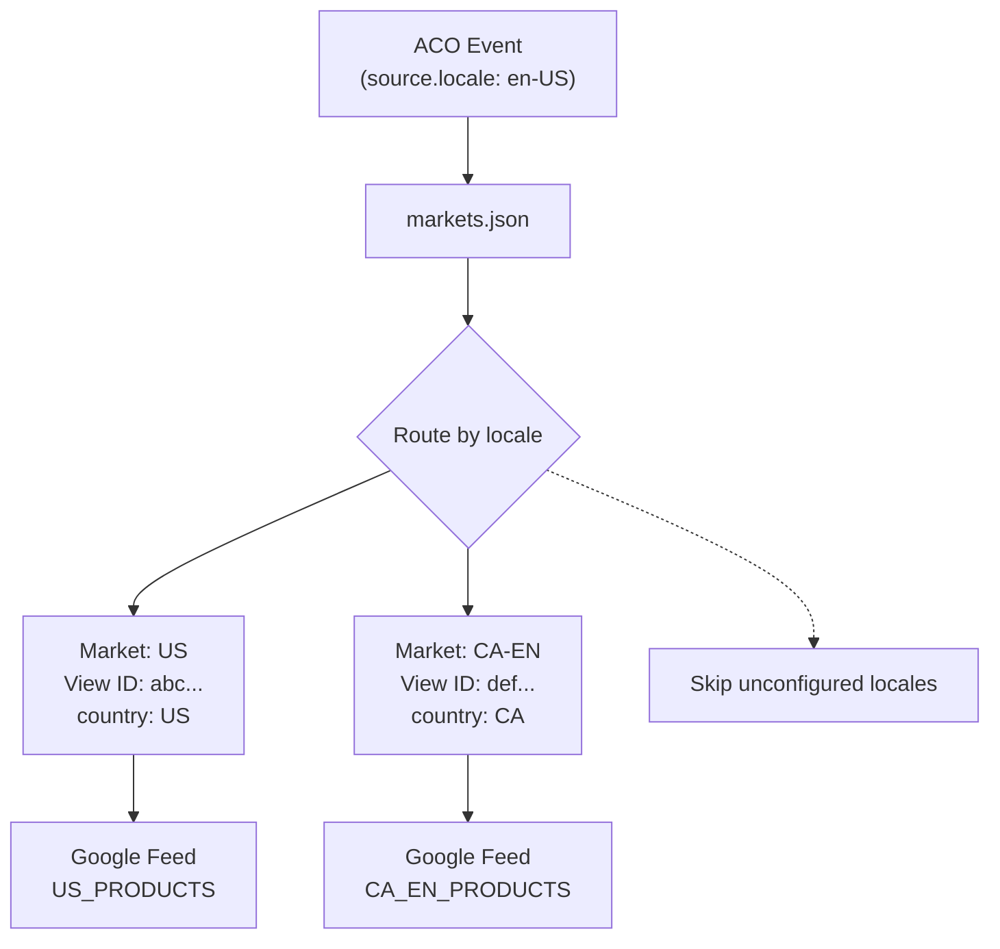
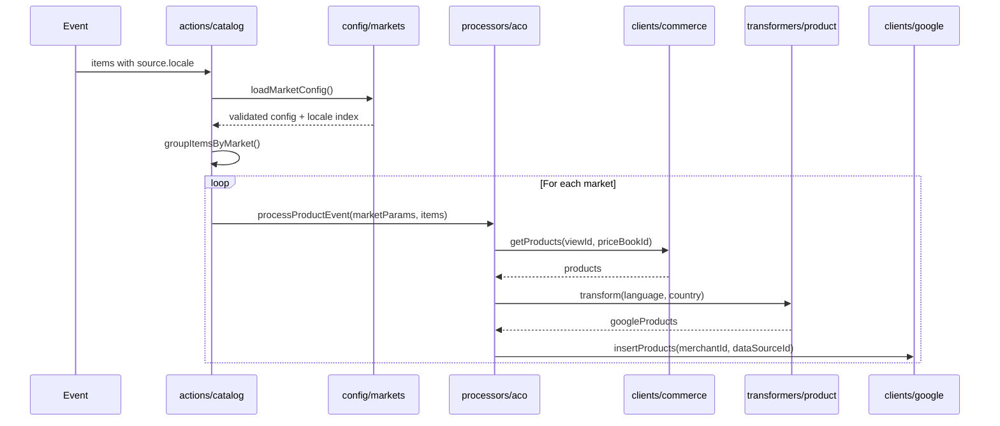

# Market Configuration

This directory contains configuration files that define how Adobe Commerce Optimizer (ACO) catalog data is mapped to Google Merchant Center feeds.

## Overview

The market configuration enables a single App Builder deployment to support multiple markets (countries/regions), each with their own:

- ACO Catalog View and Price Book
- Google Merchant Center data source and feed settings
- Storefront URL structure

### Event Routing



### Processing Flow



## Files

| File                   | Description                                     |
| ---------------------- | ----------------------------------------------- |
| `markets.json`         | Your market configuration (create from example) |
| `markets.example.json` | Example configuration template                  |
| `markets.schema.json`  | JSON Schema for validation                      |

## Configuration

Copy `markets.example.json` to `markets.json` and configure your markets:

```bash
cp config/markets.example.json config/markets.json
```

### Structure

```json
[
  {
    "id": "us",
    "aco": {
      "viewId": "us-catalog-view",
      "priceBookId": "usd-prices",
      "source": {
        "locale": "en-US"
      }
    },
    "google": {
      "merchantId": "123456789",
      "dataSourceId": "1234567890",
      "feedLabel": "US_PRODUCTS",
      "contentLanguage": "en",
      "targetCountry": "US"
    },
    "store": {
      "urlTemplate": "https://mystore.com/products/{urlKey}"
    }
  }
]
```

### Field Reference

#### Market

| Field | Type   | Description                                                |
| ----- | ------ | ---------------------------------------------------------- |
| `id`  | string | Unique identifier for this market (e.g., `us`, `uk`, `de`) |

#### ACO Configuration (`aco`)

| Field           | Type   | Description                                                          |
| --------------- | ------ | -------------------------------------------------------------------- |
| `viewId`        | string | ACO Catalog View ID for this market                                  |
| `priceBookId`   | string | ACO Price Book ID containing prices for this market                  |
| `source.locale` | string | The `source.locale` value from ACO events that routes to this market |

#### Google Configuration (`google`)

| Field             | Type   | Description                                                                                                                            |
| ----------------- | ------ | -------------------------------------------------------------------------------------------------------------------------------------- |
| `merchantId`      | string | Your Google Merchant Center account ID                                                                                                 |
| `dataSourceId`    | string | The ID of the Data Source in Google Merchant Center for this feed                                                                      |
| `feedLabel`       | string | Label identifying this feed (e.g., `US_PRODUCTS`)                                                                                      |
| `contentLanguage` | string | [ISO 639-1](https://en.wikipedia.org/wiki/List_of_ISO_639_language_codes) language code (e.g., `en`, `es`, `fr`)                       |
| `targetCountry`   | string | [ISO 3166-1](https://en.wikipedia.org/wiki/ISO_3166-1_alpha-2#Officially_assigned_code_elements) country code (e.g., `US`, `GB`, `DE`) |

#### Store Configuration (`store`)

| Field         | Type   | Description                                                                                                                                                                                                                                                  |
| ------------- | ------ | ------------------------------------------------------------------------------------------------------------------------------------------------------------------------------------------------------------------------------------------------------------ |
| `urlTemplate` | string | The template format of your storefront product links (ie. `https://mystore.com/products/{sku}`). _Note:_ This value depends on how your canonical product links are composed and the customization of the `transformers/product.js::getProductUrl` function. |

## Important Constraints

### Currency Matching

Google Merchant Center requires that product prices match the expected currency for the target country. For example:

- **US** requires **USD**
- **UK** requires **GBP**
- **Germany** requires **EUR**

See [Supported languages and currencies](https://support.google.com/merchants/answer/160637) for the complete list.

## Examples

### Single Market (US Only)

```json
[
  {
    "id": "us",
    "aco": {
      "viewId": "default-view",
      "priceBookId": "default-prices",
      "source": { "locale": "en-US" }
    },
    "google": {
      "merchantId": "123456789",
      "dataSourceId": "1234567890",
      "feedLabel": "PRODUCTS",
      "contentLanguage": "en",
      "targetCountry": "US"
    },
    "store": {
      "urlTemplate": "https://mystore.com/p/{urlKey}"
    }
  }
]
```

### Multi-Market (US + UK)

```json
[
  {
    "id": "us",
    "aco": {
      "viewId": "us-view",
      "priceBookId": "usd-prices",
      "source": { "locale": "en-US" }
    },
    "google": {
      "merchantId": "123456789",
      "dataSourceId": "1111111111",
      "feedLabel": "US_PRODUCTS",
      "contentLanguage": "en",
      "targetCountry": "US"
    },
    "store": {
      "urlTemplate": "https://mystore.com/en-us/products/{urlKey}"
    }
  },
  {
    "id": "uk",
    "aco": {
      "viewId": "uk-view",
      "priceBookId": "gbp-prices",
      "source": { "locale": "en-GB" }
    },
    "google": {
      "merchantId": "123456789",
      "dataSourceId": "2222222222",
      "feedLabel": "UK_PRODUCTS",
      "contentLanguage": "en",
      "targetCountry": "GB"
    },
    "store": {
      "urlTemplate": "https://mystore.co.uk/products/{urlKey}"
    }
  }
]
```

### Multi-Language Market (Canada: English + French)

```json
[
  {
    "id": "ca-en",
    "aco": {
      "viewId": "canada-english-view",
      "priceBookId": "cad-prices",
      "source": { "locale": "en-CA" }
    },
    "google": {
      "merchantId": "123456789",
      "dataSourceId": "3333333333",
      "feedLabel": "CA_EN_PRODUCTS",
      "contentLanguage": "en",
      "targetCountry": "CA"
    },
    "store": {
      "urlTemplate": "https://mystore.ca/en/products/{urlKey}"
    }
  },
  {
    "id": "ca-fr",
    "aco": {
      "viewId": "canada-french-view",
      "priceBookId": "cad-prices",
      "source": { "locale": "fr-CA" }
    },
    "google": {
      "merchantId": "123456789",
      "dataSourceId": "4444444444",
      "feedLabel": "CA_FR_PRODUCTS",
      "contentLanguage": "fr",
      "targetCountry": "CA"
    },
    "store": {
      "urlTemplate": "https://mystore.ca/fr/products/{urlKey}"
    }
  }
]
```

## Validation

The configuration is validated against `markets.schema.json`. Validation includes:

- Required fields presence
- Correct data types
- Unique market IDs

If validation fails, the application will log an error and reject the event.
