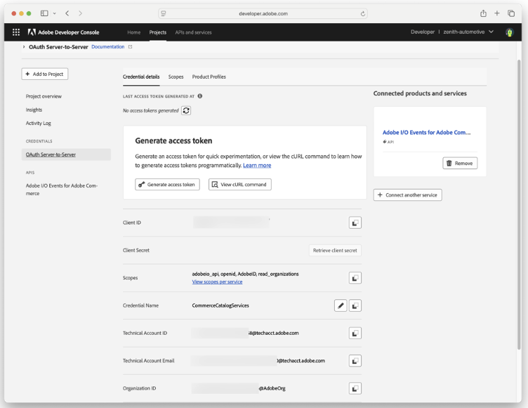

# Testing Event Payloads

This directory contains example event payloads for testing the Google Merchant Center integration locally.

## Before You Start

Make sure your local server is running:

```sh
aio app dev
```

### Authorization

If `require-adobe-auth` is `true` in [app.config.yaml](../app.config.yaml), an `Authorization` header with your Dev Console project's access token will need to be provided in the test event call.

An access token can be generated in your [Developer Console](https://developer.adobe.com/console) in the Project's **Credentials** section.



## Customizing Payloads

Before sending a test event, you need to update the payload with your own data:

### Required Fields to Update

| Field                           | Description                                         | Example                    |
| ------------------------------- | --------------------------------------------------- | -------------------------- |
| `data.instanceId`               | Your Commerce Optimizer tenant ID                   | `"XdAHsRLZSusTtmCu3Kzobk"` |
| `items[].sku`                   | A product SKU from your catalog                     | `"blue-tshirt-medium"`     |
| `items[].sources[].locale`      | Locale matching your market config (product events) | `"en-US"`                  |
| `items[].sources[].priceBookId` | Price book ID (price events only)                   | `"global_visibility"`      |

### For Complex Products (Variants)

When testing variant products, you also need to set the `links` field to reference the parent SKU:

```json
{
  "sku": "child-sku-1",
  "operation": "update",
  "links": [{ "type": "variantOf", "sku": "parent-sku" }],
  "sources": [{ "locale": "en-US" }]
}
```

---

## Product Events

Product events sync product data to Google Merchant Center. The `operation` field determines whether to create, update, or delete the product.

### Create a Simple Product

Creates a new simple product in Google Merchant Center.

See [product/aco_create_simple_product_payload.json](./product/aco_create_simple_product_payload.json) for the full payload structure.

```sh
curl -k -X POST https://localhost:9080/api/v1/web/aco-google-merchant-center/catalog \
  -H "Content-Type: application/json" \
  -H "Authorization: Bearer {ims_access_token}" \
  -d '{
    "specversion": "1.0",
    "type": "com.adobe.commerce.storefront.events.product.ccdm",
    "source": "urn:uuid:fb58963f-d2e7-4ab4-83da-b6ff15b8ebc0",
    "id": "23f76cef-9f14-44b1-bbd0-29995789c98e",
    "time": "2025-12-17T12:00:00.000Z",
    "datacontenttype": "application/json",
    "data": {
      "instanceId": "YOUR_TENANT_ID",
      "items": [
        {
          "sku": "YOUR_PRODUCT_SKU",
          "operation": "create",
          "sources": [{ "locale": "en-US" }]
        }
      ]
    }
  }'
```

**Expected output:**

```json
{
  "type": "com.adobe.commerce.storefront.events.product.ccdm",
  "response": {
    "message": "Processed 1 item(s) across 1 market(s) for tenant: YOUR_TENANT_ID"
  }
}
```

### Update a Simple Product

Updates an existing simple product in Google Merchant Center.

See [product/aco_update_simple_product_payload.json](./product/aco_update_simple_product_payload.json) for the full payload structure.

```sh
curl -k -X POST https://localhost:9080/api/v1/web/aco-google-merchant-center/catalog \
  -H "Content-Type: application/json" \
  -H "Authorization: Bearer {ims_access_token}" \
  -d '{
    "specversion": "1.0",
    "type": "com.adobe.commerce.storefront.events.product.ccdm",
    "source": "urn:uuid:fb58963f-d2e7-4ab4-83da-b6ff15b8ebc0",
    "id": "23f76cef-9f14-44b1-bbd0-29995789c98e",
    "time": "2025-12-17T12:00:00.000Z",
    "datacontenttype": "application/json",
    "data": {
      "instanceId": "YOUR_TENANT_ID",
      "items": [
        {
          "sku": "YOUR_PRODUCT_SKU",
          "operation": "update",
          "sources": [{ "locale": "en-US" }]
        }
      ]
    }
  }'
```

### Delete a Simple Product

Removes a product from Google Merchant Center.

See [product/aco_delete_simple_product_payload.json](./product/aco_delete_simple_product_payload.json) for the full payload structure.

```sh
curl -k -X POST https://localhost:9080/api/v1/web/aco-google-merchant-center/catalog \
  -H "Content-Type: application/json" \
  -H "Authorization: Bearer {ims_access_token}" \
  -d '{
    "specversion": "1.0",
    "type": "com.adobe.commerce.storefront.events.product.ccdm",
    "source": "urn:uuid:fb58963f-d2e7-4ab4-83da-b6ff15b8ebc0",
    "id": "23f76cef-9f14-44b1-bbd0-29995789c98e",
    "time": "2025-12-17T12:00:00.000Z",
    "datacontenttype": "application/json",
    "data": {
      "instanceId": "YOUR_TENANT_ID",
      "items": [
        {
          "sku": "YOUR_PRODUCT_SKU",
          "operation": "delete",
          "sources": [{ "locale": "en-US" }]
        }
      ]
    }
  }'
```

---

## Complex Product Events (Parent/Variant)

Complex products (configurable products with variants) require special handling. Google Merchant Center expects only **variant products** to be submitted, not parent products. All variants are linked together using the `itemGroupId` attribute, which is automatically set to the parent SKU.

### Create a Variant Product

Updates a variant product in Google Merchant Center. The `links` field with `variantOf` tells the system this is a variant of a parent product.

See [product/aco_update_complex_variant_product_payload.json](./product/aco_create_complex_variant_product_payload.json) for the full payload structure.

```sh
curl -k -X POST https://localhost:9080/api/v1/web/aco-google-merchant-center/catalog \
  -H "Content-Type: application/json" \
  -H "Authorization: Bearer {ims_access_token}" \
  -d '{
    "specversion": "1.0",
    "type": "com.adobe.commerce.storefront.events.product.ccdm",
    "source": "urn:uuid:fb58963f-d2e7-4ab4-83da-b6ff15b8ebc0",
    "id": "23f76cef-9f14-44b1-bbd0-29995789c98e",
    "time": "2025-12-17T12:00:00.000Z",
    "datacontenttype": "application/json",
    "data": {
      "instanceId": "YOUR_TENANT_ID",
      "items": [
        {
          "sku": "YOUR_VARIANT_SKU",
          "operation": "create",
          "links": [{ "type": "variantOf", "sku": "YOUR_PARENT_SKU" }],
          "sources": [{ "locale": "en-US" }]
        }
      ]
    }
  }'
```

**Expected output:**

```json
{
  "type": "com.adobe.commerce.storefront.events.product.ccdm",
  "response": {
    "message": "Processed 1 item(s) across 1 market(s) for tenant: YOUR_TENANT_ID"
  }
}
```

The variant will be sent to Google Merchant Center with an `itemGroupId` set to the parent SKU, linking all variants together as a product family.

### Parent Product Events (Complex Product)

When a parent SKU event is received (without the `variantOf` link), the system detects it as a complex product and **skips** sending it to Google Merchant Center. This is intentional as only variant products should be submitted per Google's guidelines.

```sh
curl -k -X POST https://localhost:9080/api/v1/web/aco-google-merchant-center/catalog \
  -H "Content-Type: application/json" \
  -H "Authorization: Bearer {ims_access_token}" \
  -d '{
    "specversion": "1.0",
    "type": "com.adobe.commerce.storefront.events.product.ccdm",
    "source": "urn:uuid:fb58963f-d2e7-4ab4-83da-b6ff15b8ebc0",
    "id": "23f76cef-9f14-44b1-bbd0-29995789c98e",
    "time": "2025-12-17T12:00:00.000Z",
    "datacontenttype": "application/json",
    "data": {
      "instanceId": "YOUR_TENANT_ID",
      "items": [
        {
          "sku": "YOUR_PARENT_SKU",
          "operation": "create",
          "sources": [{ "locale": "en-US" }]
        }
      ]
    }
  }'
```

**Expected console log:**

```
info: Skipping complex product parent YOUR_PARENT_SKU - only variants are sent to GMC
```

**Expected output:**

```json
{
  "type": "com.adobe.commerce.storefront.events.product.ccdm",
  "response": {
    "message": "Processed 1 item(s) across 1 market(s) for tenant: YOUR_TENANT_ID"
  }
}
```

> **Note:** The response indicates the event was processed successfully, but the parent product itself is not sent to Google Merchant Center. This is expected behavior.

---

## Price Events

Price events update product pricing in Google Merchant Center. They use `priceBookId` instead of `locale` in the `sources` field.

See example payloads in the [price/](./price/) directory.

### Update a Price

```sh
curl -k -X POST https://localhost:9080/api/v1/web/aco-google-merchant-center/catalog \
  -H "Content-Type: application/json" \
  -H "Authorization: Bearer {ims_access_token}" \
  -d '{
    "specversion": "1.0",
    "type": "com.adobe.commerce.storefront.events.price.ccdm",
    "source": "urn:uuid:fb58963f-d2e7-4ab4-83da-b6ff15b8ebc0",
    "id": "23f76cef-9f14-44b1-bbd0-29995789c98e",
    "time": "2025-12-17T12:00:00.000Z",
    "datacontenttype": "application/json",
    "data": {
      "instanceId": "YOUR_TENANT_ID",
      "items": [
        {
          "sku": "YOUR_PRODUCT_SKU",
          "operation": "update",
          "sources": [{ "priceBookId": "YOUR_PRICE_BOOK_ID" }]
        }
      ]
    }
  }'
```

> **Note:** Make sure the `priceBookId` matches one configured in your `config/markets/markets.json`.

---

## Troubleshooting

### "Event tenant ID does not match expected tenant ID"

The `instanceId` in your payload doesn't match the `ACO_TENANT_ID` in your `.env` file. Update either value so they match.

### "No event items matched configured markets"

The `locale` in your payload's `sources` doesn't match any market in `config/markets/markets.json`. Check that your locale (e.g., `en-US`) is configured.

### Product not appearing in Google Merchant Center

- Check the console logs for errors from the Google API
- Verify your Google service account credentials are valid
- Ensure the product has all required fields (title, price, availability, etc.)

### Complex product parent being skipped

This is expected behavior. Only variant products are sent to Google Merchant Center. The parent product event is processed but intentionally not submitted.
